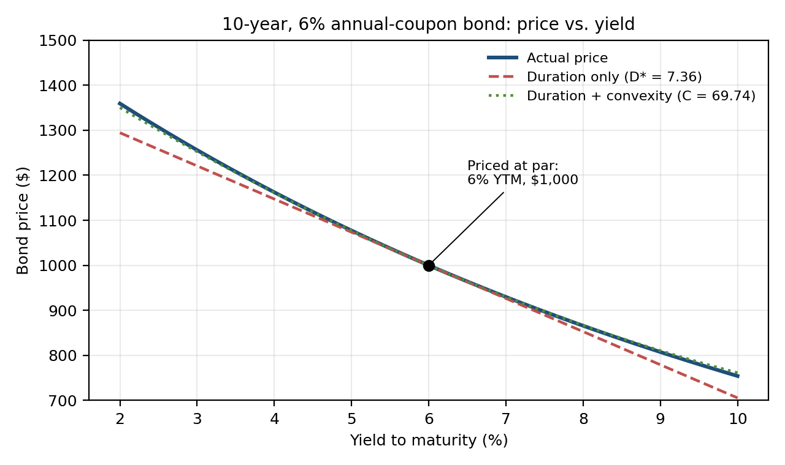

# Mini Study Guide 7: Convexity and the Duration-Convexity Approximation

*BKM Ch. 16*

[← All study guides](../../study-guide-index.md)

FIN 4000 Investments · Midterm prep · Sep 28, 2026 · Jim Northey

## Learning objectives

Duration treats the price-yield relationship as a straight line. It is a curve, so duration alone understates price gains and overstates price losses. Adding the convexity term fixes most of the error.

After this guide you should be able to:

1. Compute Macaulay duration, modified duration, and convexity for a simple bond.
2. Estimate a bond's price change with the duration-only and the duration-plus-convexity formulas.
3. Explain why convexity is valuable and which bond features increase it.
4. Explain negative convexity in callable bonds and mortgage-backed securities.

## Core concept

Modified duration gives the slope of the price-yield curve at today's yield. For small yield changes the tangent line is a good estimate. For large changes the curve bends away from the line, and the bond always does *better* than the line predicts.



The gap between the two lines is the convexity effect. It is small near 6% and grows with the size of the yield change, in either direction.

### The formulas

```math
D = \frac{1}{P}\sum_{t=1}^{T} t \cdot \frac{CF_t}{(1+y)^t} \qquad D^{*} = \frac{D}{1+y}
```

**Where:**

- D = Macaulay duration, in years
- D* = modified duration
- P = bond price
- t = time (in years) when each cash flow is paid
- CFₜ = cash flow paid at time t
- y = yield to maturity per period, as a decimal
- T = years to maturity

```math
\text{Convexity} = \frac{1}{P(1+y)^2}\sum_{t=1}^{T} \frac{CF_t}{(1+y)^t}\,(t^2 + t)
```

**Where:**

- Convexity = curvature of the price-yield relationship
- P = bond price
- y = yield to maturity per period, as a decimal
- CFₜ = cash flow paid at time t
- t = time of each cash flow, in years
- T = years to maturity

```math
\frac{\Delta P}{P} \approx \underbrace{-D^{*}\,\Delta y}_{\text{duration}} \; + \; \underbrace{\tfrac{1}{2}\times\text{Convexity}\times(\Delta y)^2}_{\text{convexity adjustment}}
```

**Where:**

- ΔP/P = percentage change in the bond's price
- D* = modified duration
- Δy = change in yield, as a decimal (1% = 0.01)
- Convexity = the bond's convexity

The convexity term is always positive for a plain bond, because (Δy)² is positive whether yields rise or fall. Use Δy in decimals (1% = 0.01).

### What increases convexity

| Feature | Effect on convexity |
| --- | --- |
| Longer maturity (or duration) | Higher |
| Lower coupon | Higher |
| Lower yield | Higher |
| Call feature (callable bond) or prepayment option (MBS) | Can turn **negative** when yields fall and the option is near the money |

### Why investors value convexity

Two bonds with the same duration and yield: the more convex one gains more when yields fall and loses less when they rise. Investors pay for that, so more convex bonds trade at higher prices and lower yields. Callable bonds and MBS have *negative* convexity at low yields. Their prices are capped because the issuer or homeowner will refinance, so investors demand a higher yield to hold them.

## Worked examples

### Example 1: Duration and convexity of the chart's bond (Algorithmic)

A 10-year, 6% annual-coupon bond yields 6%, so it sells at par (\$1,000).

- Macaulay duration D = **7.80 years**
- Modified duration D* = 7.80 / 1.06 = **7.36**
- Convexity = **69.74**

On an exam, modified duration and convexity are usually given. To compute them yourself, build one row per cash flow in Excel (t, CF, PV, t × PV, (t² + t) × PV) and apply the formulas above. Excel check: `=MDURATION(settle, maturity, 0.06, 0.06, 1)` returns 7.36.

### Example 2: Rate shocks, estimated vs. actual (Algorithmic)

**Yields rise 2% (Δy = +0.02):**

1. Duration only: −7.36 × 0.02 = **−14.72%**
2. Convexity adjustment: ½ × 69.74 × (0.02)² = +1.39%
3. Duration + convexity: −14.72% + 1.39% = **−13.33%**
4. Actual (reprice at 8%: \$865.80): **−13.42%**

**All four scenarios:**

| Yield change | Duration only | Duration + convexity | Actual | New price |
| --- | --- | --- | --- | --- |
| +2.0% | −14.72% | −13.33% | −13.42% | \$865.80 |
| −2.0% | +14.72% | +16.12% | +16.22% | \$1,162.22 |
| +0.5% | −3.68% | −3.59% | −3.59% | \$964.06 |
| −0.5% | +3.68% | +3.77% | +3.77% | \$1,037.69 |

**What to notice:**

- Duration alone overstates the loss and understates the gain.
- The convexity adjustment closes almost all the gap.
- For a 0.5% move the error from duration alone is under 0.1%. For a 2% move it is about 1.4%. The error grows with the square of Δy.

**BA II Plus (actual price at 8%):** `10` `N` · `8` `I/Y` · `60` `PMT` · `1000` `FV` · `CPT` `PV` → −865.80

### Example 3: Given-value exam problem (Algorithmic)

A bond sells for \$950. Its modified duration is 6 and its convexity is 50. Yields fall 0.5%.

1. Duration effect: −6 × (−0.005) = +3.00%
2. Convexity effect: ½ × 50 × (0.005)² = +0.0625%
3. Total: +3.0625%. New price ≈ 950 × 1.030625 = **\$979.09**

## Common pitfalls

- **Percent vs. decimal.** Use Δy = 0.01 for 1%. Squaring 1 instead of 0.01 makes the convexity term 10,000 times too big.
- **Subtracting the convexity term when yields rise.** (Δy)² is positive either way, so the adjustment is always added for a plain bond.
- **Using Macaulay duration in the price formula.** The formula uses modified duration, D* = D / (1 + y).
- **Forgetting the ½.** The convexity term is ½ × Convexity × (Δy)².
- **Assuming callable bonds have positive convexity.** Near the call price they are negatively convex.

## Key terms and definitions

- [ ] **Macaulay duration:** the weighted-average time to receipt of a bond's cash flows, with weights equal to each cash flow's share of the bond's price.
- [ ] **Modified duration:** Macaulay duration ÷ (1 + y); the approximate percentage price change for a 1% change in yield.
- [ ] **Effective duration:** duration estimated from model prices after small rate shifts; used for bonds with embedded options.
- [ ] **Convexity:** a measure of the curvature of the price-yield relationship.
- [ ] **Positive vs. negative convexity:** positive means prices rise more than they fall for equal yield moves; negative means price gains are capped (callable bonds, MBS).
- [ ] **Price-yield curve:** a plot of bond price against yield; convex for option-free bonds.
- [ ] **Duration-with-convexity rule:** ΔP/P ≈ −D* Δy + ½ × Convexity × (Δy)².
- [ ] **Price compression (callable bonds):** the cap on a callable bond's price near the call price as yields fall.
- [ ] **Prepayment risk (MBS):** the risk that homeowners repay early when rates fall, returning principal when reinvestment rates are low.

## CFA-style practice questions

**Q1 [Algorithmic].** A bond has a modified duration of 8 and convexity of 90. If yields rise 1%, its estimated percentage price change is *closest* to:

- A. −8.45%
- B. −8.00%
- C. −7.55%

**Q2 [Algorithmic].** A bond's Macaulay duration is 7.5 years and its YTM (annual) is 5%. Its modified duration is *closest* to:

- A. 7.14
- B. 7.50
- C. 7.88

**Q3 [Conceptual].** All else equal, which bond has the *greatest* convexity?

- A. 5-year, 8% coupon
- B. 20-year, 8% coupon
- C. 20-year, 2% coupon

**Q4 [Conceptual].** For a plain (option-free) bond, a duration-only estimate of price change will:

- A. overstate both price gains and price losses.
- B. understate price gains and overstate price losses.
- C. overstate price gains and understate price losses.

**Q5 [Algorithmic].** A bond sells for \$950 with modified duration 6 and convexity 50. If yields fall 0.5%, the estimated new price is *closest* to:

- A. \$978.50
- B. \$979.09
- C. \$1,007.00

**Q6 [Conceptual].** When yields fall well below the coupon rate, a callable bond *most likely* shows:

- A. positive convexity greater than a comparable straight bond.
- B. negative convexity.
- C. zero duration.

**Q7 [Algorithmic].** A 3-year, 10% annual-coupon bond yields 10%. Its Macaulay duration is *closest* to:

- A. 2.49 years
- B. 2.74 years
- C. 3.00 years

**Q8 [Conceptual].** Two option-free bonds have the same duration and yield, but Bond X is more convex than Bond Y. In an efficient market:

- A. Bond X should sell at a lower yield (higher price) than Bond Y.
- B. Bond X should sell at a higher yield than Bond Y.
- C. both bonds must sell at the same price.

## Answer key

| Q | Answer | Explanation |
| --- | --- | --- |
| 1 | C | −8 × 0.01 + ½ × 90 × 0.01² = −8.00% + 0.45% = −7.55%. A subtracts the convexity term; B leaves it out. |
| 2 | A | 7.5 / 1.05 = 7.14. C multiplies by 1.05 instead of dividing. |
| 3 | C | Longer maturity and a lower coupon both raise convexity. |
| 4 | B | The true curve lies above the tangent line, so actual gains are larger and actual losses smaller than duration predicts. |
| 5 | B | +3.00% + 0.0625% = +3.0625%; 950 × 1.030625 = \$979.09. A leaves out convexity. |
| 6 | B | The call caps the price, so the price-yield curve bends the other way. |
| 7 | B | PVs: 90.91, 82.64, 826.45 (total \$1,000). D = (1 × 90.91 + 2 × 82.64 + 3 × 826.45) / 1,000 = 2.74. A is modified duration (2.74 / 1.10). |
| 8 | A | Investors value convexity, so they pay more for it and accept a lower yield. |
