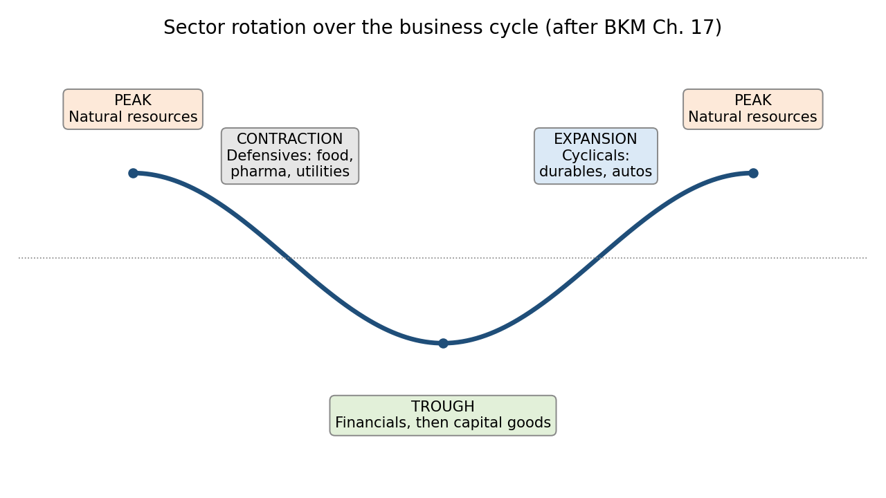

# Mini Study Guide 9: The Business Cycle and Sector Rotation

*BKM Ch. 17*

[← All study guides](../../study-guide-index.md)

FIN 4000 Investments · Final exam prep · Sep 28, 2026 · Jim Northey

## Learning objectives

Sector rotation shifts a portfolio toward the industries expected to do best in the *next* phase of the business cycle. It works only if you anticipate the turn before the market prices it in.

After this guide you should be able to:

1. Name the phases of the business cycle and the sectors BKM links to each.
2. Distinguish cyclical from defensive industries, and explain the three sensitivity factors (sales sensitivity, operating leverage, financial leverage).
3. Compute the degree of operating leverage (DOL) and use it to estimate profit swings.
4. Classify economic indicators as leading, coincident, or lagging.

## Core concept: rotating through the cycle

Each phase of the business cycle favors different industries. A sector rotation strategy overweights the industries expected to lead in the phase that is *coming*, not the one already under way.



Prices move ahead of the economy. By the time a recession is official, defensive stocks have usually already outperformed. The investor's edge is forecasting the turn better than the market.

### Cyclical vs. defensive industries

|  | Cyclical | Defensive |
| --- | --- | --- |
| Sensitivity to the economy | High (high beta) | Low (low beta) |
| Typical products | Durable goods, capital equipment, autos, travel | Food, drugs, utilities, household staples |
| Why | Purchases can be postponed | Demand continues in bad times |
| Best phase | Expansion, trough (capital goods) | Contraction |

### What makes a firm sensitive to the cycle

BKM names three factors:

1. **Sales sensitivity.** Necessities (food, drugs, medical care) have steady sales. Durables and capital goods swing widely.
2. **Operating leverage.** High fixed costs relative to variable costs magnify the effect of a sales change on operating profit.
3. **Financial leverage.** Interest is a fixed cost, so debt magnifies the effect on net profit.

```math
\text{DOL} = \frac{\%\,\Delta\,\text{Profits}}{\%\,\Delta\,\text{Sales}} = 1 + \frac{\text{Fixed costs}}{\text{Profits}}
```

**Where:**

- DOL = degree of operating leverage
- % Δ Profits = percentage change in operating profit
- % Δ Sales = percentage change in sales
- Fixed costs = costs that do not change with sales volume
- Profits = operating profit at the current level of sales

## Economic indicators

Leading indicators turn *before* the economy, so they are the ones a sector rotator watches. BKM's list follows the Conference Board's composite indexes (Table 17.2).

| Type | Moves | Examples |
| --- | --- | --- |
| **Leading** | Before the economy | Average weekly hours in manufacturing; initial unemployment claims; new orders for consumer goods and capital goods; building permits for new housing; S&P 500 stock prices; interest rate spread (10-year Treasury minus fed funds); index of consumer expectations |
| **Coincident** | With the economy | Nonfarm payroll employment; personal income less transfer payments; industrial production; manufacturing and trade sales |
| **Lagging** | After the economy | Average duration of unemployment; inventory-to-sales ratio; change in unit labor costs; average prime rate; commercial and industrial loans outstanding; consumer credit to personal income; CPI for services |

**Memory aids:**

- **Leading = decisions and expectations.** Building permits, new orders, hours worked, and stock prices reflect plans made before output changes.
- **Coincident = the economy itself.** Output, income, and employment.
- **Lagging = slow-moving balances and rates.** Loans, inventories, and the prime rate adjust after the fact.

An **inverted yield curve** (a negative 10-year minus fed funds spread) has preceded most U.S. recessions, which is why the spread is a leading indicator.

## Worked examples

### Example 1: Operating leverage across the cycle (Algorithmic)

Two firms each have \$20 million of sales and \$4 million of profit today.

- **Low-leverage firm:** fixed costs \$2M, variable costs 70% of sales.
- **High-leverage firm:** fixed costs \$8M, variable costs 40% of sales.

DOL: low = 1 + 2 / 4 = **1.5**; high = 1 + 8 / 4 = **3.0**.

| Scenario | Sales | Low-leverage profit | Change | High-leverage profit | Change |
| --- | --- | --- | --- | --- | --- |
| Recession (sales −10%) | \$18M | 18 − 12.6 − 2 = \$3.4M | −15% | 18 − 7.2 − 8 = \$2.8M | −30% |
| Normal | \$20M | \$4.0M | — | \$4.0M | — |
| Expansion (sales +10%) | \$22M | 22 − 15.4 − 2 = \$4.6M | +15% | 22 − 8.8 − 8 = \$5.2M | +30% |

Each profit change = DOL × sales change. The high-leverage firm is the better holding going into an expansion and the worse one going into a recession.

### Example 2: A rotation decision (Conceptual)

It is late in a recession. Leading indicators have turned up for three months, the Fed is cutting rates, and inflation is falling. Which tilt fits?

1. Rates are falling and the recovery is near: **financials** benefit as inflation and rates drop.
2. The trough is approaching: **capital goods** firms benefit as companies rebuild capacity.
3. Reduce **defensive** holdings (staples, utilities, pharmaceuticals). They have done their job and will lag in a recovery.
4. Not yet peak-phase **natural resources**. Commodity demand and inflation peak late in the expansion.

## Common pitfalls

- **Rotating into what is doing well now.** Prices anticipate. Position for the next phase.
- **Mixing up leading and lagging indicators.** The prime rate and loans outstanding lag; building permits and stock prices lead.
- **Treating all financials as defensive.** Financials suffer mid-recession (defaults rise) but benefit late in it (rates fall).
- **DOL formula errors.** DOL = 1 + fixed costs / *profits*, not fixed costs / sales.
- **Forgetting financial leverage.** Interest payments act like fixed costs and add to cyclical sensitivity.

## Key terms and definitions

- [ ] **Business cycle (peak, contraction, trough, expansion):** recurring rises and falls in economic activity; the peak ends an expansion and the trough ends a contraction.
- [ ] **Recession:** a significant, broad decline in economic activity lasting more than a few months.
- [ ] **Cyclical industries:** industries whose sales and profits are highly sensitive to the business cycle, such as durables and capital goods.
- [ ] **Defensive industries:** industries with little sensitivity to the cycle, such as food, pharmaceuticals, and utilities.
- [ ] **Sector rotation:** shifting a portfolio toward sectors expected to outperform in the next phase of the cycle.
- [ ] **Sales sensitivity:** how much a firm's sales change with the business cycle.
- [ ] **Degree of operating leverage (DOL):** % change in profits ÷ % change in sales; equals 1 + fixed costs ÷ profits.
- [ ] **Financial leverage:** the use of debt, whose fixed interest payments magnify swings in net profit.
- [ ] **Leading, coincident, and lagging indicators:** economic series that turn before, with, or after the economy.
- [ ] **Demand shock vs. supply shock:** an event that changes demand for goods (such as a tax cut) vs. one that changes production capacity or costs (such as an oil price spike).
- [ ] **Industry life cycle (start-up, consolidation, maturity, relative decline):** the typical stages of an industry's growth, from rapid, risky growth to slow or negative growth.

## CFA-style practice questions

**Q1 [Algorithmic].** A firm has fixed costs of \$6 million and profits of \$4 million. If sales rise 8%, profits will rise by approximately:

- A. 8%
- B. 12%
- C. 20%

**Q2 [Conceptual].** According to BKM's sector rotation pattern, which industries are *most likely* to outperform as the economy passes through the trough?

- A. Capital goods producers
- B. Natural resource extraction firms
- C. Food and pharmaceutical firms

**Q3 [Conceptual].** Which industry is *most* defensive?

- A. Automobile manufacturing
- B. Pharmaceuticals
- C. Construction equipment

**Q4 [Conceptual].** Which is a *leading* economic indicator?

- A. Industrial production
- B. Building permits for new private housing
- C. Average prime rate charged by banks

**Q5 [Algorithmic].** A firm earns profits of \$5 million and has fixed costs of \$10 million. If sales fall 5%, its profits will be *closest* to:

- A. \$3.50 million
- B. \$4.25 million
- C. \$4.75 million

**Q6 [Conceptual].** Which is a *lagging* economic indicator?

- A. Average duration of unemployment
- B. Initial claims for unemployment insurance
- C. Stock prices (S&P 500)

**Q7 [Conceptual].** An industry growing at about the rate of the overall economy, with stable profits and high dividend payouts, is *most likely* in which life-cycle stage?

- A. Start-up
- B. Consolidation
- C. Maturity

**Q8 [Conceptual].** Which firm is *most* sensitive to the business cycle?

- A. A grocery chain with low fixed costs and no debt
- B. An appliance maker with high fixed costs and heavy debt
- C. An electric utility with regulated rates

**Q9 [Conceptual].** An analyst sees the 10-year Treasury yield fall below the federal funds rate. As a leading indicator, this *most likely* signals:

- A. an economic slowdown ahead.
- B. rising inflation ahead.
- C. an expansion that is just beginning.

## Answer key

| Q | Answer | Explanation |
| --- | --- | --- |
| 1 | C | DOL = 1 + 6 / 4 = 2.5. Profit change = 2.5 × 8% = 20%. |
| 2 | A | At the trough, firms begin rebuilding capacity, so capital goods lead. B fits the peak; C fits the contraction. |
| 3 | B | Demand for drugs is steady in any economy. Autos and construction equipment are cyclical. |
| 4 | B | Permits are a plan for future building. Industrial production is coincident; the prime rate lags. |
| 5 | B | DOL = 1 + 10 / 5 = 3. Profit change = 3 × (−5%) = −15%. \$5M × 0.85 = \$4.25M. C ignores leverage (−5%). |
| 6 | A | Unemployment duration keeps rising after the economy turns. B and C are leading. |
| 7 | C | Mature industries grow with the economy and pay out much of their earnings. |
| 8 | B | Durable goods, high operating leverage, and high financial leverage all add cyclical sensitivity. |
| 9 | A | An inverted curve (long rates below short rates) has historically preceded recessions. |
