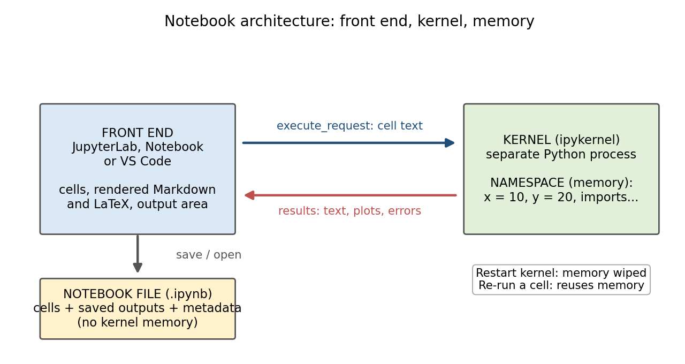

# Mini Study Guide 13: Jupyter Notebook Architecture

[← All study guides](../../study-guide-index.md)

Sep 29, 2026 · Jim Northey

A Jupyter notebook is a document in front of a live Python process: you edit cells in one place, but the kernel that runs them keeps its own memory between runs.

## At a glance



Code travels down to the kernel and results come back up; restarting empties the kernel's memory, while re-running reuses whatever it holds.

## Key terms

| Term | What it is |
| --- | --- |
| Notebook (.ipynb) | A JSON file holding your cells, their saved outputs and metadata. It does not store the kernel's memory. |
| Front end | The interface you type in: a browser (JupyterLab, classic Notebook) or VS Code. |
| Kernel | A separate process that runs your code and holds its state. |
| ipykernel | The kernel implementation for Python. |
| Jupyter server | The web server that connects a browser front end to kernels. |
| Cell | One unit of the notebook: code, Markdown or raw text. |
| Namespace | The kernel's table of names (variables, imports, functions) and the objects they point to. |
| Execution count | The `In [n]` number: the order in which the kernel ran cells, not the order on the page. |
| Output | What the kernel sends back after a run: text, tables, plots, errors. |
| Message protocol | The JSON messages (such as `execute_request`) that the front end and kernel exchange. |

## What happens when you run a cell

Running a cell sends its text to the kernel and waits for results; nothing runs in the browser or editor itself.

1. You press Shift+Enter on a code cell.
2. The front end packages the cell text as an execute request and sends it to the kernel.
3. The kernel runs the code in its namespace. Names the code creates or changes stay in memory.
4. While running, the kernel streams back printed text, plots and errors as messages.
5. The front end draws those messages in the output area below the cell and updates the `In [n]` counter.
6. Markdown cells skip steps 2 to 4: the front end renders them itself and the kernel never sees them.

## Kernel memory, restart and re-running

Variables live only in the running kernel, so saving the notebook saves your code and outputs but not your variables.

That gap creates hidden state: the page shows one thing while the kernel remembers another.

```python
# Cell A
x = 10

# Cell B
y = x * 2
print(y)
```

Run A, then B: it prints 20. Now edit A to `x = 50` but run only B: it still prints 20, because the kernel's `x` is still 10.

| Action | Kernel memory | Output on screen |
| --- | --- | --- |
| Run or re-run a cell | Changed by that cell's code | New output replaces the old |
| Interrupt | Kept, including work done before the stop | Partial output |
| Restart kernel | Wiped: a fresh, empty process | Old outputs stay, now stale |
| Restart and run all | Wiped, then rebuilt top to bottom | Replaced by fresh results |
| Clear outputs | Kept | Removed |

A notebook is trustworthy when Restart and run all produces the results you expect.

## Markdown and LaTeX

Markdown formats text and LaTeX formats math; both are written in a Markdown cell and drawn by the front end, never run by the kernel.

Markdown is a lightweight way to mark up text with plain characters. This source:

```markdown
# Compound interest

The **future value** grows with each period:

- deposit at the start
- earn interest
- repeat
```

renders as a heading, bold text and a bulleted list.

LaTeX is a typesetting language for mathematics. Put math between dollar signs in a Markdown cell (`$...$` inline, `$$...$$` on its own line) and the front end renders it. For example, `$$FV = PV(1 + r)^n$$` displays as:

```math
FV = PV(1 + r)^n
```

Pronunciation: LaTeX is "LAH-tekh" or "LAY-tekh". The final X is the Greek letter chi, so it ends in a soft "kh" sound, never "ex". The same goes for TeX, the system beneath it, which is "tekh".

## Browser vs VS Code

Both are front ends for the same kind of kernel, so the execution model does not change with the tool you pick.

| Same in both | Differs |
| --- | --- |
| Code, Markdown and output cells | Browser: JupyterLab or Notebook served by a Jupyter server |
| One kernel holds the namespace | VS Code: an extension shows the notebook inside the editor |
| Restart, interrupt and run-all commands | Where you pick the Python environment (kernel selector) |
| Markdown and LaTeX render in the front end | Editor extras: debugger, Git view, other extensions |

In either tool, check which kernel and Python environment are selected: the wrong one is a common cause of "module not found" errors.

## Habits that prevent hidden-state bugs

- Put imports and setup in the first cells, so a restart rebuilds them in order.
- Run cells top to bottom; treat an out-of-order run as an experiment.
- Before sharing or submitting, use Restart and run all and confirm nothing breaks.
- Avoid deleting a cell that defined a variable you still use: the kernel keeps the name until restart.
- Keep long or reusable logic in functions or modules, and call them from the notebook.
- Write the reason behind each step in a Markdown cell, not only the code.

## Self-check questions

| Question | Short answer |
| --- | --- |
| Where do your variables live? | In the kernel process, not in the .ipynb file. |
| What does saving a notebook store? | Cell text, saved outputs and metadata. |
| What happens to memory on Restart kernel? | It is wiped; old outputs stay on screen, now stale. |
| Why can a notebook give different results on a second run? | Cells ran out of order, so the kernel's state differed. |
| Do Markdown cells reach the kernel? | No. The front end renders them. |
| What does the execution count `In [n]` tell you? | The order the kernel ran cells, which may differ from the page order. |
| What is the fastest test that a notebook is sound? | Restart and run all. |
| How is LaTeX pronounced? | "LAH-tekh" or "LAY-tekh", with a soft "kh" at the end. |

## Hands-on exercise: reproduce hidden state

1. Create a new notebook and pick a Python kernel.
2. In cell 1 type `rate = 0.05` and run it.
3. In cell 2 type `print(1000 * (1 + rate) ** 10)` and run it. Note the result.
4. Change cell 1 to `rate = 0.08`, but do not run it. Re-run cell 2. Which rate did it use?
5. Now run cell 1, then cell 2 again. What changed, and why?
6. Use Restart kernel and re-run only cell 2. What error appears, and why?
7. Use Restart and run all. Confirm the notebook now works from top to bottom.
